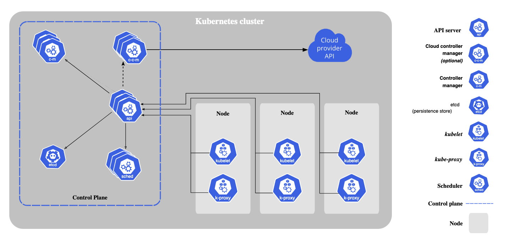
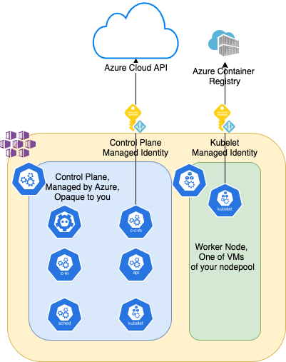

# Indentities

## 1. Overview

Of course, nothing prevents you from running minikube on your local laptop/PC, K8s on a raspberry PI, or K8s on-prem using bare metal.
However, Kubernetes was designed to run in clouds. This means it reveals all its power leveraging infinite cloud capabilities.

### Cloud Control Manager

To be able to 'talk' to a cloud, K8s requires a mechanism to do so. 
The [Cloud Controller Manager](https://kubernetes.io/docs/concepts/architecture/cloud-controller/) is a Kubernetes control plane component that embeds cloud-specific control logic. It lets you link your cluster with a cloud provider's API and separates out components that interact with a cloud platform from components that only interact with your cluster.

### How it works

When you create (submit your desired state configuration to the API service), for example, a service of type LoadBalancer, K8s API 'talks' to Cloud Controller Manager component and Cloud Controller Manager itself then talks to your cloud provider API. To interact with Azure APIs, an AKS cluster requires either an Azure Active Directory (AD) Service Principal(SP) or a Managed Identity(MI).



## 2. Service principal and Managed Identities

For a long time, SP(Service Principal) has been the only way to authenticate AKS clusters against Azure API. And if you want to know more about the say SP works here is a [official documentation](https://docs.microsoft.com/en-us/azure/active-directory/develop/app-objects-and-service-principals) for you
One of the disadvantages of SP is that SP has an expiration date. It must be renewed to keep the cluster working. By default, SP is valid for one year. It could be extended to 2 years, but this doesn't solve the issue. Another one is the segregation of different 
It is still possible to create an AKS cluster backed by SP, but the new recommended approach is to use Managed Identities. Managed identities are essentially a wrapper around service principals, and make their management simpler. Credential rotation for MI happens automatically every 46 days according to Azure Active Directory default. 
No need to renew anything. Magic comes here. Another killer feature of MIs is that MIs live as long as your cluster lives. Once you have decided to delete your cluster, MI is also being deleted. Except for the Bring Your Own Managed Identity case, which I'll highlight later.

### Q&A:

> Q: Can I update my existing SP-based AKS cluster to managed identities?

> A: Yes, you can. Follow alone this nice [official documentation](https://docs.microsoft.com/en-us/azure/aks/use-managed-identity#update-an-aks-cluster-to-managed-identities).

## 3. Managed Identities(plural)

Yes, when it comes to Managed Identities, there are a coupe of them. Shortly, I'll explain why there are multiple of them and what do we do with all this stuff.
[Here](https://docs.microsoft.com/en-us/azure/aks/use-managed-identity#summary-of-managed-identities) is a summary of Managed Identities.




### Control Plane Managed Identity

As it has been mentioned, AKS(Cloud Controller Manager) talks to Azure API. So, [Control Plane](https://kubernetes.io/docs/concepts/overview/components/#control-plane-components) requires authentication mechanism.
Here Control Plane Managed Identity(CP MI) shows up. Also, using Azure Network, Control Plane Managed Identity controls the subnet your cluster is backed by with.

### Kubelet Managed Identity

There are some good enhancements Azure has augmented AKS with. One of the examples would be an integration of an AKS with an Azure Container Registry(ACR). The default way to get images from a private container registry would be through [creating a secret](https://kubernetes.io/docs/tasks/configure-pod-container/pull-image-private-registry/#create-a-secret-by-providing-credentials-on-the-command-line) of a docker type and [using it while creating a pod](https://kubernetes.io/docs/tasks/configure-pod-container/pull-image-private-registry/#create-a-pod-that-uses-your-secret) or [adding ImagePullSecrets to a Service Account](https://kubernetes.io/docs/tasks/configure-pod-container/configure-service-account/#add-image-pull-secret-to-service-account). But, we all know secrets inside K8s [are not secrets at all](https://kubernetes.io/docs/concepts/configuration/secret/#risks) and can be easily decoded.
So, the best practice of getting access to ACR would be direct access based on Azure native authentication mechanism.

Control Plane and Cloud Control Manager in particular has nothing to do with your ACR. It simply doesn't 'talk' to it. However, Node in your nodepool does.
When a deployment is been submitted, a node needs to pull the image in order to spin up a container. Kubelet Managed Identity helps to simplify this integration and, which is important, to make it even more secure.
This is the case where Kubelet Managed Identity is being used.

### Q&A:

> Q: I've created a cluster with Managed Identities via Azure Portal. In my [MC_](https://docs.microsoft.com/en-us/azure/aks/faq#why-are-two-resource-groups-created-with-aks) Resource Group I can see only one MI  *cluster_name-resource_group-agentpool*. Is it a CP MI or Kubelete MI?

> A: No. This is Kubelet MI. If you create cluster with dynamic(SystemAssigned) MI provisioning(MI is being provisioning along side cluster creation), you will see only Kubelet MI in your MC_ group. CP MI will be opaque to you.

> Q: if I delete a cluster with  dynamic(SystemAssigned) MI provisioning, will it delete both CP MI and Kubelet MI?

> A: Yes, it will

## 4. Complex Scenarios

### Overview

One of the common scenario in larger organization that everyone get the least privileged access. Which, by the way, is an absolutely right way of implementing security. At most 'Contributor' role is being granted(there is a department that takes care of all Identities and role assignments) to engineers who create stuff in Azure Cloud. This won't be an issue at all to create an AKS cluster, unless you need to use existing resources or hit some policy restrictions.

Another  common scenario is a [NOC](https://en.wikipedia.org/wiki/Network_operations_center) department that takes care of network design and implementation. Which means no self-created VNETs.

The combination of 2 might create a bit of a problem.

### Scenario #1: Pre-existing network, AKS is backed by [Azure CNI](https://docs.microsoft.com/en-us/azure/aks/configure-azure-cni)

When, for example, an engineer with a 'Contributor' role wants to create an AKS cluster leveraging pre-defined networking he/she/they can face an issue with assigning permissions (Network Contributor) to a CP Managed Identity. This role assignment is essential as CP MI requires control IPs in a subnet dedicated to AKS.

In this case I'd suggest **creating** Managed Identity for a Control Plane and Managed Identity for a Kubelet and **assigning right privileges over existing resources** prior the cluster creation.

* [Bring your own control plane MI](https://docs.microsoft.com/en-gb/azure/aks/use-managed-identity#bring-your-own-control-plane-mi)

* [Bring your own kubelet MI](https://docs.microsoft.com/en-gb/azure/aks/use-managed-identity#bring-your-own-kubelet-mi)

### Q&A:
> Q: If I delete a cluster backed by BYO CP MI and BYO Kubelet MI. Will those two be deleted as well?

> A: No, BYO CP MI and BYO Kubelet MI will stay and you can later re-use them.

## 5. Labs

### 01-Identities

Let's create Managed Identities. Later will use them alongside our journey creating bulletproof production-ready AKS cluster.

1. Define variables

```bash
RESOURCE_GROUP="bulletproofaks"
LOCATION="westeurope"
CLUSTER_NAME="bpaks"
CP_MI="bpaks-cp-mi"
KUBELET_MI="bpaks-kubelet-mi"

```

2. Create Resource Group

```bash
az group create -n $RESOURCE_GROUP -l $LOCATION
```

3. Create control plane MI

```bash
az identity create --name $CP_MI --resource-group $RESOURCE_GROUP
```

4. Create kubelet MI

```bash
az identity create --name $KUBELET_MI --resource-group $RESOURCE_GROUP
```
