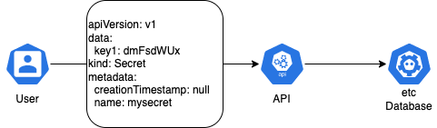

# AKS Secrets

Recently I was privileged to coach [OpenHack](https://openhack.microsoft.com/) Containers once again. This event is designed to build up some AKS and containers skills. It is a very well-designed 3-day event that is based on a real problem of a real company. One of the challenges among others is to implement the integration of an AKS with an Azure KeyVault.

Commonly, a sophisticated application requires access to data and, usually, such access must be restricted. So, you need to provide your pod/deployment/replicaSet/DaemonSet with a key to access this data. And there is a way to do so by using secrets.

Let's go!


## Kubernetes Secrets

The default way to secure data in a cluster is [Kubernetes Secrets](https://kubernetes.io/docs/concepts/configuration/secret/). A Secret is an object that contains a small amount of sensitive data such as a password, a token, or a key. Precisely, individual secrets are limited to 1MiB in size.
When you create a secret(submit to an AKS API your desired state configuration), a database record is being created. Kubernetes, by default(most commonly), is backed by etcD database. [And for AKS it is not an exception](https://docs.microsoft.com/en-us/azure/aks/concepts-clusters-workloads#control-plane). The size limit could be explained by common sense and the etcD storage limitations. [EtcD database storage size is limited to 8Gb](https://etcd.io/docs/v3.5/dev-guide/limit/#storage-size-limit).



However, Kubernetes Secrets are, by default, stored unencrypted. Of course, there are ways to secure them by:
1. [Enabling Encryption at Rest for Secrets](https://kubernetes.io/docs/tasks/administer-cluster/encrypt-data/). By the way, this is one of the tasks in CKS exam. But, this option is no applicable for AKS as you do not have access to Control Plane components.
2. Enable or configure RBAC rules that restrict reading data in Secrets (including via indirect means).
3. Where appropriate, also use mechanisms such as RBAC to limit which principals are allowed to create new Secrets or replace existing ones.

Kubernetes Secrets approach for securing data is better than nothing. But, in my humble opinion, is not a production-grade way to do so.

## Azure KevVault integration using CSI driver and user/system-assigned Managed Identity

In one of my [previous articles](https://mehighlow.medium.com/building-up-a-hardened-production-ready-aks-cluster-01-identities-64e472f1d043) I have described the way AKS interacts with Azure Cloud Objects using Managed Identities.

The Azure Key Vault Provider for Secrets Store CSI Driver allows integration of an Azure key vault as a secrets store with an Azure Kubernetes Service (AKS) cluster via a CSI volume.

### How does it work?

There are 2 daemonSets(actually, 4: 2 for Linux nodes and 2 for Windows nodes with an appropriate nodeSelector) aks-secrets-store-csi-driver and aks-secrets-store-provider being deployed when you enable azure-keyvault-secrets-provider addon. Each deamonSet creates a pod on each node of your nodepool. When you create a SecretProviderClass object, the pod(s) of the aks-secrets-store-provider daemonSet authenticates in Azure AD and gets a token. Pod interacts with Azure KeyVault using this token. As we grant our Managed Identity to access KeyVault objects, pods of the aks-secrets-store-provider demonSet using token can get Azure KeyVault objects. aks-secrets-store-csi-driver creates a volume with retrieved KeyVault objects.

In other words, a managed identity that is being 'attached' to Node, works pretty much the same way as a [Linux VM system-assigned managed identity accesses Azure Resource Manager](https://docs.microsoft.com/en-us/azure/active-directory/managed-identities-azure-resources/tutorial-linux-vm-access-arm).

To intergate your AKS cluster with Azure KeyVault you need to:
1. [Have/Create an Azure KeyVault](https://docs.microsoft.com/en-us/azure/aks/csi-secrets-store-driver#create-or-use-an-existing-azure-key-vault)
2. Install *aks-secrets-store-csi-driver* and  *aks-secrets-store-provider* [daemonSets](https://kubernetes.io/docs/concepts/workloads/controllers/daemonset/). In this [official documentation](https://docs.microsoft.com/en-us/azure/aks/csi-secrets-store-driver) you can find the instructions.

The Secrets Store CSI Driver allows for the following methods to access an Azure key vault:

1. A managed identity: [user-assigned](https://docs.microsoft.com/en-us/azure/aks/csi-secrets-store-identity-access#use-a-user-assigned-managed-identity) or [system-assigned](https://docs.microsoft.com/en-us/azure/aks/csi-secrets-store-identity-access#use-a-system-assigned-managed-identity) (in this section)
2. An [Azure Active Directory pod identity](https://docs.microsoft.com/en-us/azure/aks/csi-secrets-store-identity-access#use-pod-identities) (in the next section)

In this article, we'll use System Assigned Managed Identity.
When you enable Azure Key Vault Provider for Secrets Store CSI Driver a System Assigned Managed Identity gets created. You can find it in your MC_ group. This MI is assigned to all VMSSs(to every node of every nodepool. Nodepools are backed by VMSS). We need to grant this MI some permission so a VM that backs your Worker Node and has this MI attached can access Azure KeyVault.

#### 1. Enable Azure Key Vault Provider for Secrets Store CSI Driver support

```bash
az aks enable-addons --addons azure-keyvault-secrets-provider --name myAKSCluster --resource-group myResourceGroup
```

When you enable the addon, you will see the `azurekeyvaultsecretsprovider-<clustername>` Managed Identity


#### 2. Let's get ID(clientID) of this Managed Identity

```bash
az aks show -g <resource-group> -n <cluster-name> --query addonProfiles.azureKeyvaultSecretsProvider.identity.clientId -o tsv
```

#### 3. Create an Azure KeyVault

```bash
az keyvault create -n <your-unique-keyvault-name> -g <your-resource-group> -l westeurope
```

#### 4. Create some secrets

```bash
az keyvault secret set --vault-name "<your-unique-keyvault-name>" --name "secret1" --value "password1"

az keyvault secret set --vault-name "<your-unique-keyvault-name>" --name "secret2" --value "password2"
```

#### 5. Set policy to access secrets in your key vault

```bash
az keyvault set-policy -n <keyvault-name> --secret-permissions get --spn <identity-client-id>
```

Once you grant permissions to your managed identity, you will see the results in the Access Configuration of your Azure KeyVault


Now A VM via Managed Identity can access Azure KevVault, but AKS knows nothing about it. Let's define a configuration(namely, we create *SecretProviderClass* object) for our cluster.

#### 6. Create SecretProviderClass

```yaml
apiVersion: secrets-store.csi.x-k8s.io/v1
kind: SecretProviderClass
metadata:
  name: azure-kvname-sys-msi
spec:
  provider: azure
  parameters:
    usePodIdentity: "false"               # Set to true for using PodIdentity 
    useVMManagedIdentity: "true"          # Set to true for using managed identity
    userAssignedIdentityID: <client-id>   # Set the clientID of the user-assigned managed identity to use
    keyvaultName: <key-vault-name>        # Set to the name of your key vault
    cloudName: ""                         # [OPTIONAL for Azure] if not provided, the Azure environment defaults to AzurePublicCloud
    objects:  |
      array:
        - |
          objectName: secret1
          objectType: secret              # object types: secret, key, or cert
          objectAlias: SECRET_1           # Secret names can only conta alphanumeric characters and dashes. objectAlias mitigates this restriction so you can override the name and stick to your naming conventions.
          objectVersion: ""               # [OPTIONAL] object versions, default to latest if empty
        - |
          objectName: secret2
          objectType: secret
          objectAlias: SECRET_2           # Secret names can only conta alphanumeric characters and dashes. objectAlias mitigates this restriction so you can override the name and stick to your naming conventions.
          objectVersion: ""
    tenantId: <tenant-id>                 # The tenant ID of the key vault
```

#### 7. Mount secrets to your pod

```yaml
kind: Pod
apiVersion: v1
metadata:
  name: busybox-secrets-store-inline-system-msi
spec:
  containers:
    - name: busybox
      image: k8s.gcr.io/e2e-test-images/busybox:1.29-1
      command:
        - "/bin/sleep"
        - "10000"
      volumeMounts:
      - name: secrets-store01-inline
        mountPath: "/mnt/secrets-store"
        readOnly: true
  volumes:
    - name: secrets-store01-inline
      csi:
        driver: secrets-store.csi.k8s.io
        readOnly: true
        volumeAttributes:
          secretProviderClass: "azure-kvname-sys-msi"
```

### The overall diagram looks like this:


### Q&A
> **Q:** Can I use aks-agentpool managed identity?
>
> **A:** Yes, you can. This Managed Identity is attached to all VMs of your nodepools as well. However, if you install Secrets Store CSI Driver as an addon, a dedicated MI is being installed as well and you'll get a useless object to manage.

> **Q:** Can I use BYO MI?
> 
> **A:** Yes, you can. In this case, you need to install Secrets Store CSI Driver, not as an addon, but using [helm chart](https://github.com/Azure/secrets-store-csi-driver-provider-azure/blob/master/charts/csi-secrets-store-provider-azure/README.md) or manual installation.

### Pros and Cons

#### Pros:
* no default Secrets
* better management of the secrets
* autorotation of the secrets

#### Cons:
* for multitenant environments without a proper RBAC it is possible to retrieve secrets of other applications.

## Azure KeyVault Integration using CSI Driver and POD identity

This [official documentation](https://docs.microsoft.com/en-us/azure/aks/csi-secrets-store-identity-access#use-pod-identities) describes how to implement Azure KeyVault integration using POD Identity.

#### Note
The feature described in this article will never get the Generally Available(GA) status and will be replaced with pod-managed identities V2.

#### Limitations
* A maximum of 200 pod identities are allowed for a cluster.
* A maximum of 200 pod identity exceptions are allowed for a cluster.
* Pod-managed identities are available on Linux node pools only.

Integration using POD identity works a bit differently compared to integration using user/system assigned Managed Identity. When you enable this addon, no Managed Identity is being created in the MC_ resource group and attached to a node of your nodepools.
However, Managed Identity is still required and you need to create it manually.

*Using Azure KevVault integration using CSI driver and user/system-assigned Managed Identity(previous section), AKS Secret Store Provider interacts with Azure Instance Metadata Service directly. Because an Identity is being attached to a node a request originates from.*

#### How does it work?

When you enable Pod Identity a [Node Managed Identity (NMI)](https://azure.github.io/aad-pod-identity/docs/concepts/nmi/) DaemonSet is being deployed. It intercepts requests to security token requests to the [Azure Instance Metadata Service](https://docs.microsoft.com/en-us/azure/virtual-machines/linux/instance-metadata-service?tabs=linux) on each node, redirects them to itself, and validates if the pod has access to the identity. If the validation is successful, it requests a token from Azure AD on behalf of the application using Managed Identity.

During this setup, I'm using an AKS cluster that is backed by Azure CNI

#### 1. Enable Pod Identity

```bash
az aks update -g $MY_RESOURCE_GROUP -n $MY_CLUSTER --enable-pod-identity
```

#### 2. Create an identity

```bash
az identity create --resource-group ${MY_RESOURCE_GROUP} --name ${IDENTITY_NAME}
IDENTITY_CLIENT_ID="$(az identity show -g ${MY_RESOURCE_GROUP} -n ${IDENTITY_NAME} --query clientId -otsv)"
IDENTITY_RESOURCE_ID="$(az identity show -g ${MY_RESOURCE_GROUP} -n ${IDENTITY_NAME} --query id -otsv)"
```

#### 3. Assign permissions for the managed identity

1. Get MC_ Resource Group name
2. Get MC_ Resource Group id
3. Assign "Virtual Machine Contributor" role over MC_ resource group to a Managed Identity we have created earlier.

```bash
NODE_GROUP=$(az aks show -g myResourceGroup -n myAKSCluster --query nodeResourceGroup -o tsv)
NODES_RESOURCE_ID=$(az group show -n $NODE_GROUP -o tsv --query "id")
az role assignment create --role "Virtual Machine Contributor" --assignee "$IDENTITY_CLIENT_ID" --scope $NODES_RESOURCE_ID
```

#### 4. Assign permissions to the new identity to enable it to read your key vault and view its contents by running the following commands

```bash
az keyvault set-policy -n <keyvault-name> --secret-permissions get --spn <pod-identity-client-id>
```

#### 5. Install CSI driver

```bash
helm repo add csi-secrets-store-provider-azure https://raw.githubusercontent.com/Azure/secrets-store-csi-driver-provider-azure/master/charts
helm install csi csi-secrets-store-provider-azure/csi-secrets-store-provider-azure
```

#### 6. Create an Azure KeyVault

```bash
az keyvault create -n <your-unique-keyvault-name> -g <your-resource-group> -l westeurope
```

#### 7. Create some secrets

```bash
az keyvault secret set --vault-name "<your-unique-keyvault-name>" --name "secret1" --value "password1"

az keyvault secret set --vault-name "<your-unique-keyvault-name>" --name "secret2" --value "password2"
```

#### 8. Create a SecretProviderClass

Use your own values for `aadpodidbinding`, `tenantId`, and the `objects` to retrieve from your key vault:

```yaml
apiVersion: secrets-store.csi.x-k8s.io/v1
kind: SecretProviderClass
metadata:
  name: azure-kvname-podid
spec:
  provider: azure
  parameters:
    usePodIdentity: "true"               # Set to true for using aad-pod-identity to access your key vault
    keyvaultName: <key-vault-name>       # Set to the name of your key vault
    cloudName: ""                        # [OPTIONAL for Azure] if not provided, the Azure environment defaults to AzurePublicCloud
    objects:  |
      array:
        - |
          objectName: secret1
          objectType: secret              # object types: secret, key, or cert
          objectAlias: SECRET_1           # Secret names can only conta alphanumeric characters and dashes. objectAlias mitigates this restriction so you can override the name and stick to your naming conventions.
          objectVersion: ""               # [OPTIONAL] object versions, default to latest if empty
        - |
          objectName: secret2
          objectType: secret
          objectAlias: SECRET_2           # Secret names can only conta alphanumeric characters and dashes. objectAlias mitigates this restriction so you can override the name and stick to your naming conventions.
          objectVersion: ""
    tenantId: <tenant-id>                 # The tenant ID of the key vault
```

#### 9. Create pod identity

```bash
POD_IDENTITY_NAME="my-pod-identity"
POD_IDENTITY_NAMESPACE="default" # later, we deploy a pod to the default namespace 
az aks pod-identity add --resource-group myResourceGroup --cluster-name myAKSCluster --namespace ${POD_IDENTITY_NAMESPACE}  --name ${POD_IDENTITY_NAME} --identity-resource-id ${IDENTITY_RESOURCE_ID}
```

```json
  "podIdentityProfile": {
    "allowNetworkPluginKubenet": null,
    "enabled": true,
    "userAssignedIdentities": [
      {
        "bindingSelector": null,
        "identity": {
          "clientId": "ba04f295-1bb1-4107-b3ca-e37ed6bc3db7",
          "objectId": "f7790494-6502-4a6b-aca7-0294641e1ddc",
          "resourceId": "/subscriptions/xxxxxxxx-xxxx-xxxx-xxxx-xxxxxxxxxxxx/resourcegroups/rg/providers/Microsoft.ManagedIdentity/userAssignedIdentities/pod-identity"
        },
        "name": "my-pod-identity",
        "namespace": "default",
        "provisioningInfo": null,
        "provisioningState": "Assigned"
      },
    ],
    "userAssignedIdentityExceptions": null
  },
```

When you create a pod identity, a new record that links the name of pod identity and the ID of the managed identity is being created. So, when the Node Managed Identity (NMI) intercepts the request to the [Azure Instance Metadata Service](https://docs.microsoft.com/en-us/azure/virtual-machines/linux/instance-metadata-service?tabs=linux) for a security token it uses Managed Identity.

#### 10. Create a pod

```yaml
kind: Pod
apiVersion: v1
metadata:
  name: busybox-secrets-store-inline-podid
  labels:
    aadpodidbinding: $POD_IDENTITY_NAME  # my-pod-identity
spec:
  containers:
    - name: busybox
      image: k8s.gcr.io/e2e-test-images/busybox:1.29-1
      command:
        - "/bin/sleep"
        - "10000"
      volumeMounts:
      - name: secrets-store01-inline
        mountPath: "/mnt/secrets-store"
        readOnly: true
  volumes:
    - name: secrets-store01-inline
      csi:
        driver: secrets-store.csi.k8s.io
        readOnly: true
        volumeAttributes:
          secretProviderClass: "azure-kvname-podid"
```

When you enable pod-managed identity on your AKS cluster, an AzurePodIdentityException named aks-addon-exception is added to the kube-system namespace. An AzurePodIdentityException allows pods with certain labels to access the Azure Instance Metadata Service (IMDS) endpoint without being intercepted by the NMI server.

### The overall diagram looks like this:


### Pros and Cons

#### Pros:

* the securest approach

#### Cons:

* Private preview feature. Won't be promoted to General Available version
* Twisted configuration. The more moving parts you have, the greater the chance of failure

## Personal Opinion

### Summing up

Secrets require proper management. Make sure you have RBAC in place.

### Kubernetes Secrets
The good old way. Suits perfectly for development. Won't consider this approach for AKS production clusters.

### Azure KevVault integration using CSI driver and user/system-assigned Managed Identity
So far the only production-grade approach for Azure native secret managements for AKS and Azure KeyVault.

### Azure KeyVault Integration using CSI Driver and POD identity

This is too twisted. Doesn't represent a reliable approach as it is still adds Managed Identities to a node where the other pods can run and potentially get secrets. Require additional efforts to install and manage. Works only with Linux nodes.
Looking forward to v2 of implementation that is expected somewhere Q2 2022.
